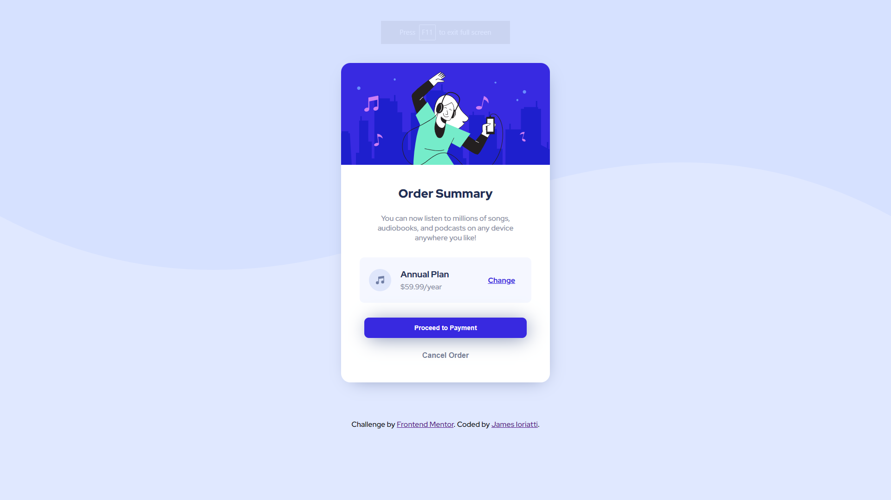
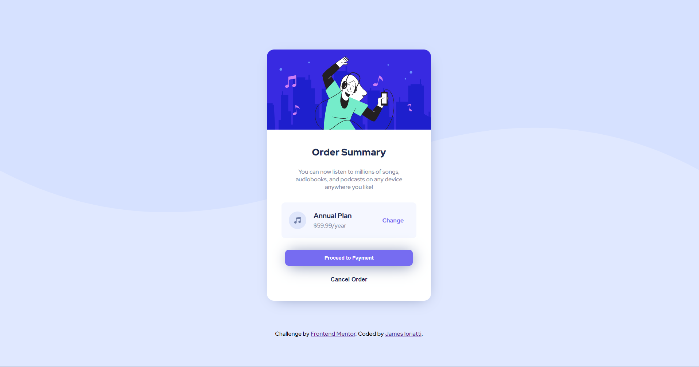
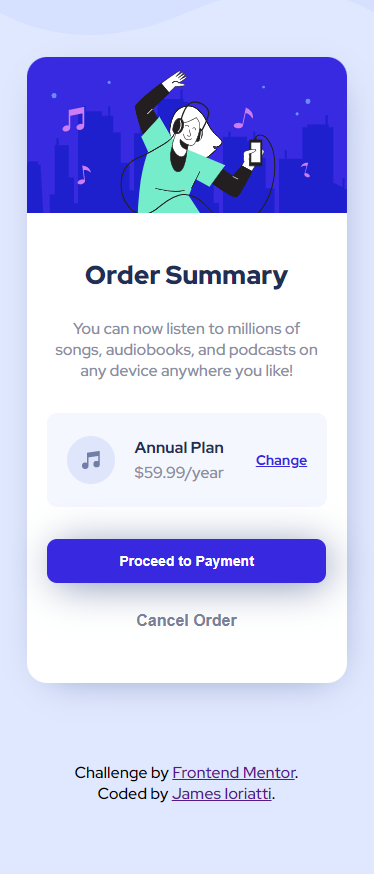

# Frontend Mentor - Order summary card solution

This is a solution to the [Order summary card challenge on Frontend Mentor](https://www.frontendmentor.io/challenges/order-summary-component-QlPmajDUj). Frontend Mentor challenges help you improve your coding skills by building realistic projects. 

## Table of contents

- [Overview](#overview)
  - [The challenge](#the-challenge)
  - [Screenshot](#screenshot)
  - [Links](#links)
- [My process](#my-process)
  - [Built with](#built-with)
  - [What I learned](#what-i-learned)
  - [Continued development](#continued-development)
  - [Useful resources](#useful-resources)
- [Author](#author)
- [Acknowledgments](#acknowledgments)

## Overview

### The challenge

In this challenge, developers were tasked to create an order summary card that allowed the user to view, change, and review their payment plan in a clean and user-friendly format.

Users should be able to:

- See hover states for interactive elements

### Screenshot






### Links

- Solution URL: [Solution](https://www.frontendmentor.io/solutions/responsive-card-layout-using-css-and-flexbox-ya_7h4XX2X)
- Live Site URL: [GitPages Deploy](https://jioriatti.github.io/frontend-mentor-order-summary/)

## My process

### Built with

- CSS custom properties
- Flexbox

### What I learned

I found this challenge to be a great opportunity to refine my CSS and HTML skills as well as reinforce my understanding of core concepts in CSS.
I utilized Flexbox and it's parent-child relationship fundamentals to properly orient content, as well as incorporated media queries to allow content to be adaptive for mobile. For future challenges I will take a mobile-first approach, as this challenge proved that trying to add styles for mobile to overwrite desktop styles is inneficient and can cause code to become very sloppy.

```css
.details-container{
    display: flex;
    flex-direction: column;
    align-items: center;
    height: 475px;
    margin-top: -10px;
    border-radius: 0px 0px 20px 20px;
    background-color: white;
}

.payment-plan{
    display: flex;
    flex-direction: row;
    width: 330px;
    background-color: var(--n-very-pale-blue);
    align-items: center;
    border-radius: 10px;
    padding: 20px;
    margin: 1em 0 2em 0;
}

@media (max-width: 600px)  {
    .card{
        width: 320px;
        height: 625px;
    }
    .payment-plan{
        width: 75%;
    }
    .plan-header{
        font-size: 16px;
    }
    .change-plan{
        font-size: 14px;
        margin-left: 2em;
    }
    .payment-btn{
        width: 87%;
    }
    p.description{
        padding: 0 1.75em 0 1.75em;
    }
    .attribution{
        text-align: center;
    }
}
```

### Continued development

As stated prior, mobile-first approach as well as media queries in general are a focus for me going forward with future projects.

### Useful resources

- [w3schoools](https://www.w3schools.com) - Great resource for any web-dev concept that I use frequently when needing to reference documentation.

## Author

- GitHub - [James Ioriatti](https://github.com/JIoriatti)
- Frontend Mentor - [@JIoriatti](https://www.frontendmentor.io/profile/JIoriatti)

## Acknowledgments

Thank you to the Northwestern Bootcamp team for equipping me with the tools and knowledge to break into the web-development industry and start my journey as a developer.

